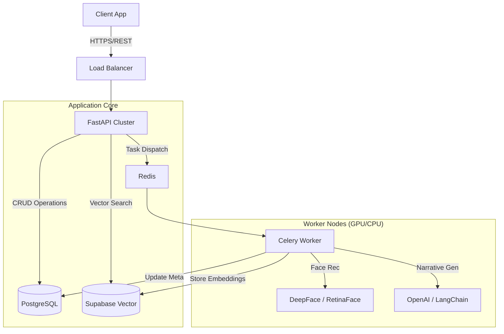
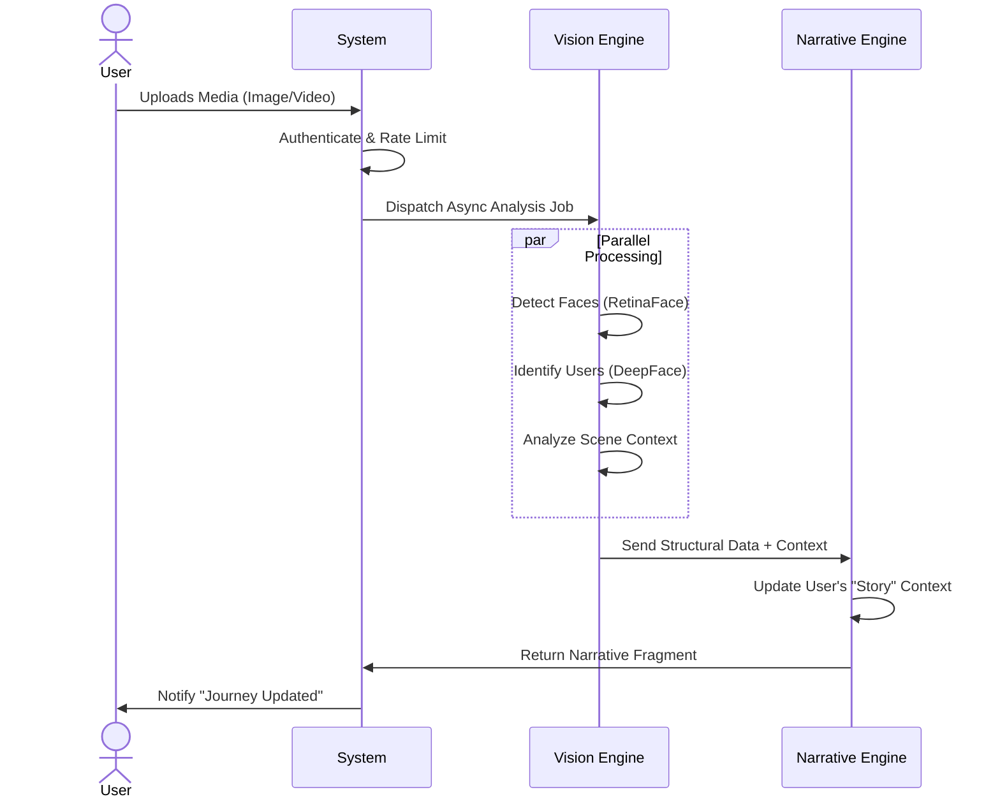

# Bard


---

**Bard** is an enterprise-grade AI application designed to autonomously track, analyze, and narrate user journeys. By fusing advanced computer vision (DeepFace/RetinaFace) with Large Language Models (LangChain/OpenAI), Bard transforms static media into a living, searchable narrative of a user's life.

## � Key Features

- **🤖 Autonomous Narrative Generation**: Compiles disjointed life moments into a cohesive story using LLMs.
- **👁️ Advanced Biometrics**: Utilizing **DeepFace** and **RetinaFace** for high-precision facial recognition and scene analysis.
- **🔍 Semantic Memory**: Powered by **Supabase pgvector** for context-aware search capabilities over user history.
- **⚡ Asynchronous Processing**: Robust **Celery + Redis** architecture for handling heavy ML inference tasks without blocking the main thread.
- **🛡️ Enterprise Security**: JWT-based authentication, role-based access control (RBAC), and secure credential management.

## 🛠 Tech Stack & Libraries

### Core Backend
- **FastAPI**: High-performance async web framework.
- **SQLAlchemy (Async)**: Modern ORM for non-blocking database operations.
- **Alembic**: Database migration tool for schema evolution.
- **Pydantic**: Data validation and settings management.

### Machine Learning & AI
- **LangChain**: Framework for orchestration of LLM flows.
- **DeepFace**: Lightweight face recognition and facial attribute analysis wrapper.
- **RetinaFace**: State-of-the-art face detection.
- **TensorFlow / Keras**: Backend engines for deep learning models.
- **OpenCV**: Computer vision utility library.

### Infrastructure & Data
- **PostgreSQL**: Primary relational database.
- **Supabase**: Vector embeddings storage and retrieval.
- **Redis**: In-memory data store for caching and message brokerage.
- **Docker**: Containerization for consistent deployment environments.

## 🏗 System Architecture



## 🔄 User Journey Flow



## ⚙️ Production Deployment

### Prerequisites
- **Docker Engine** (v24+) & **Docker Compose**
- **NVIDIA Container Toolkit** (Optional, for GPU acceleration)
- **Environment Variables**: See `.env.example`

### 1. Configuration
Create a production `.env` file. Ensure `SECRET_KEY` is a cryptographically strong random string.

```bash
cp .env.example .env
# Edit .env and set secure passwords and keys
```

### 2. Deployment (Docker)
Build and deploy the service mesh. The default configuration sets up the API, Database, Redis, and Workers.

```bash
docker-compose -f docker-compose.yml up --build -d
```

### 3. Database Migrations
Apply the database schema to the production database container.

```bash
docker-compose exec app alembic upgrade head
```

### 4. Verification
Check the health status of the services.

```bash
curl http://localhost:8000/health
# Output: {"status": "ok"}
```

## 📂 Project Structure

```text
app/
├── api/v1/          # Versioned API endpoints
├── core/            # Security, Config, and Middleware
├── db/              # Database sessions and Relational Models
├── models/          # SQLAlchemy definitions
├── schemas/         # Pydantic DTOs
└── ...
```
